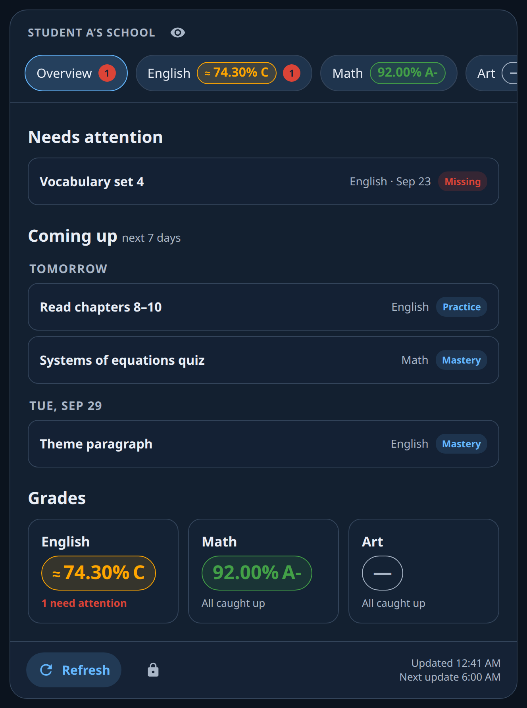
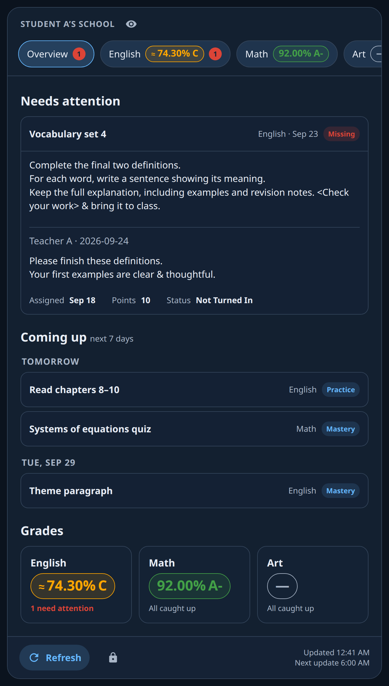
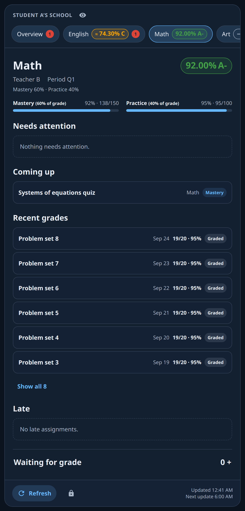
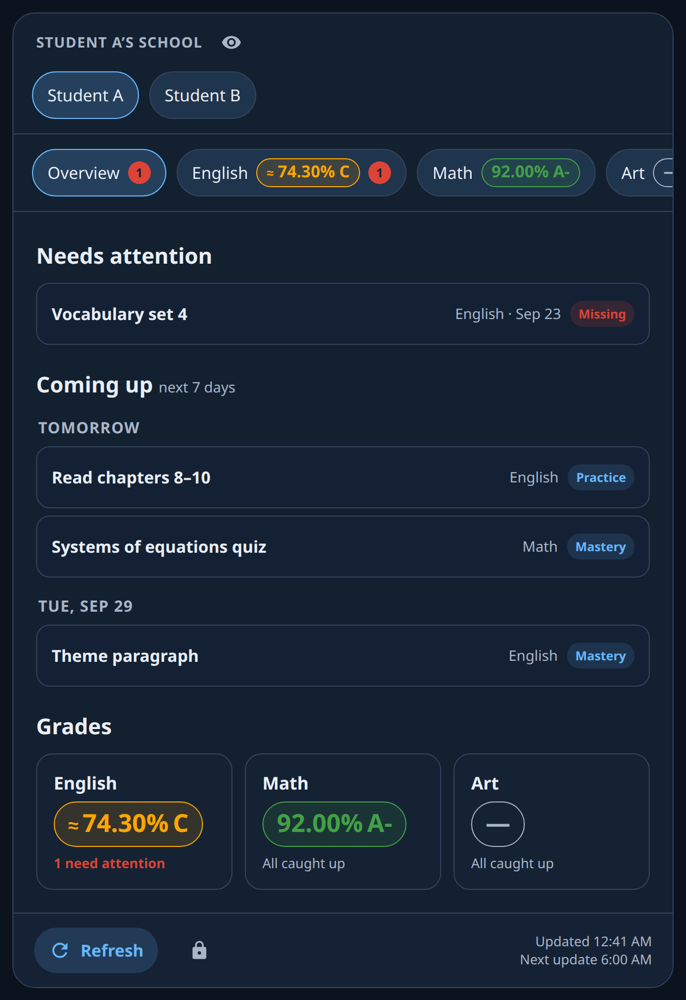
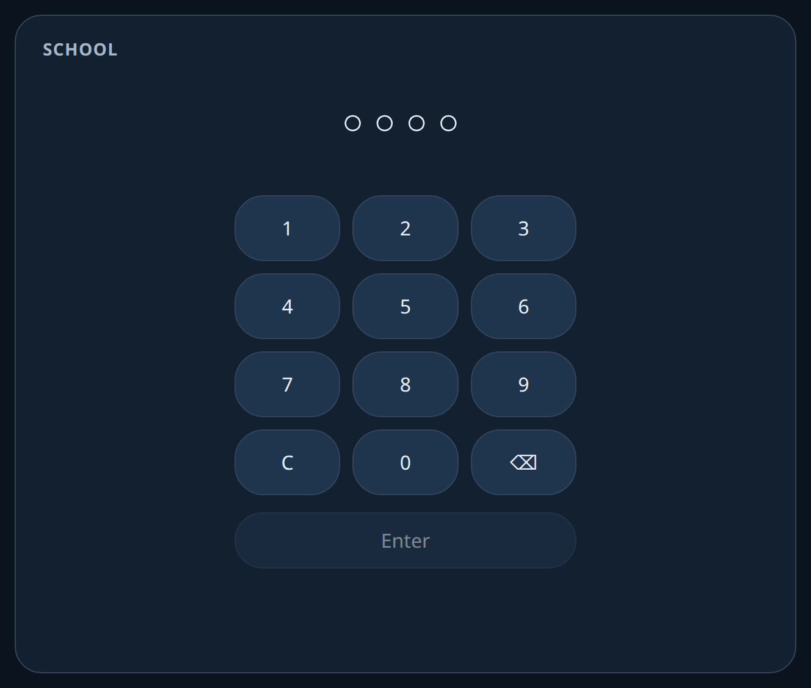
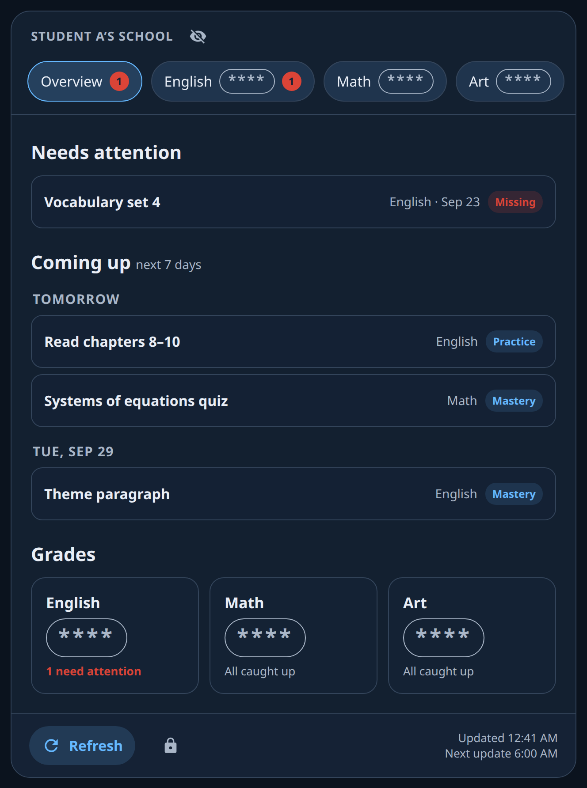

# Veracross for Home Assistant

See your children's grades, upcoming work, missing assignments, and teacher feedback in Home Assistant. A standalone Veracross card brings everything together on a family dashboard or wall tablet.

<p align="center">
  
  
</p>

This is an **unofficial integration, not affiliated with Veracross**. It reads the parent portal and makes **GET requests only after login**; it cannot submit assignments or change school records. Check your school's acceptable-use terms before connecting it.

Requires Home Assistant **2026.9.0 or newer**. Tested against 2026.9.3.

## Before you start

You need your **parent-portal username and password** and your **school code**. The code is the path segment immediately after the hostname in your portal or login URL:

- `https://accounts.veracross.com/<code>/portals/login`
- `https://portals.veracross.com/<code>/parent`

For example, the synthetic URL `https://portals.veracross.com/demo/parent` uses `demo`. Enter only the code, without slashes. There is no default school.

**SSO logins through Google or Microsoft and CAPTCHA-protected logins are not supported.** Setup reports authentication/unsupported-login or CAPTCHA errors. Use a direct parent-portal login if your school provides one.

## Install

### HACS

Until this integration is listed in HACS:

1. Open HACS → menu → **Custom repositories**.
2. Add `https://github.com/sss4885/veracross-integration`, category **Integration**.
3. Find **Veracross**, download it, and restart Home Assistant.

### Manual

Copy `custom_components/veracross` from this repository into your Home Assistant configuration directory, so the manifest is at `/config/custom_components/veracross/manifest.json`. Restart Home Assistant.

The integration automatically serves and loads its bundled card. **No manual Lovelace resource is needed.**

## Connect your family

1. Open **Settings → Devices & services → Add integration → Veracross**.
2. Enter your parent login and school code.
3. Pick the students to add, then pick classes for each student. Classes with a current numeric grade are selected initially.
4. On each student's menu, choose **Reconfigure** to set their PIN and presentation preferences.
5. Use the account's **Configure** button to set a parent PIN if you want one keypad entry to access all students.

To add another child later, choose **Add student** on the integration, pick an available student, and select classes.

### Student settings: Reconfigure

| Option | What it does |
|---|---|
| Classes | Select at least one class and drag to set its order in the card and summary. Unselected classes remain available as hidden sensors. |
| Class names | The next step has one name box per selected class. These are linked to Home Assistant entity names; renaming an entity updates the card and events too. Blank or default text clears the override. Entity IDs stay stable. |
| Late mode | Choose how Late assignments affect the attention list and count; see below. |
| PIN | Optional 4–8 ASCII digits. Blank removes the student's PIN; a parent PIN can still open their view. |
| Coming-up days | Nonnegative number of days for integration upcoming counts; default 7. Zero includes today only. The card has its own optional display window. |

| Late mode | Late in Needs attention | Late counted in badges/summary | Separate Late section |
|---|---|---|---|
| `separate` (default) | No | No | Yes |
| `listed` | Yes | No | No |
| `counted` | Yes | Yes | No |

Other assignments flagged as problems by the portal still need attention. Missing work is listed first within each class.

### Account settings: Configure

- **Parent PIN:** optional 4–8 ASCII digits; opens all students with a switcher. Blank removes it.
- **PIN lockout:** enabled by default. Five wrong attempts within 60 seconds lock the account for 60 seconds.
- **Re-discover classes:** refreshes the available class list. New classes start hidden; select them in the student's Reconfigure flow.

Student and parent PINs must be unique **within the account**. With multiple accounts, use distinct PINs across them as well: the first loaded matching account unlocks, and others lock. Restarting or reloading locks the card. PIN state is shared across connected dashboards, not per browser.

## Entities and useful dashboards

Entity IDs below illustrate synthetic Student 1; use your actual IDs from Home Assistant.

| Entity | State / purpose |
|---|---|
| `sensor.veracross_student_1_english` | Class percentage, or unknown if ungraded. Attributes include teacher, letter, grade source, grading period, weighting, shown flag, and attention/late/upcoming counts. |
| `sensor.veracross_student_1_summary` | Total needs-attention count for selected classes; includes ordered class references, last success, refreshing status, and totals. |
| `button.veracross_student_1_refresh` | Refreshes all students in the account. |
| `sensor.veracross_active_student` | `none` while locked, a student ID, or `all` for parent access; includes unlock/lockout timestamps. |

There is a grade sensor for **every discovered class**. Percentages use `state_class: measurement`, enabling history graphs and long-term statistics through Home Assistant's recorder. Use them for grade-below-X alerts, conditional cards, or per-child dashboards. Events let automations react to new missing work without recording full assignment lists.

Unselected classes are **hidden, not disabled**: their grade, letter, and teacher still update from the shared overview request, so history continues. Assignment details and feedback are not fetched for these classes; they do not contribute to summaries or appear in the card. Showing a class clears integration-owned hiding while preserving hiding you set yourself.

Official portal grades take precedence. If an official grade is unavailable, selected classes can use a calculated grade; check `grade_source` because school weighting policies can differ.

## Events and automations

The initial full refresh establishes a baseline without notification events. Later changes emit:

| Event | Payload fields |
|---|---|
| `veracross_grade_changed` | `student_id`, `student`, `class_id`, `class`, `old_grade`, `new_grade`, `old_letter`, `new_letter` |
| `veracross_assignment_changed` | `student_id`, `student`, `class_id`, `class`, `assignment_id`, `title`, `change`, `old`, `new` |

`old` and `new` contain changed fields, not necessarily the whole assignment. `change` may be `new`, `graded`, `regraded`, `status`, `notes`, `due`, `removed`, or `other`. Portal Missing/Not Turned In has `status_id: 1`.

Paste each example into a new automation's YAML editor. They use built-in persistent notifications; replace that action with your preferred notification service if desired.

### Notify when a grade drops

```yaml
alias: Veracross grade drop
triggers:
  - trigger: event
    event_type: veracross_grade_changed
conditions:
  - condition: template
    value_template: >-
      {{ trigger.event.data.old_grade is number
         and trigger.event.data.new_grade is number
         and trigger.event.data.new_grade < trigger.event.data.old_grade }}
actions:
  - action: persistent_notification.create
    data:
      title: Grade changed
      message: >-
        {{ trigger.event.data.student }} — {{ trigger.event.data['class'] }}:
        {{ trigger.event.data.old_grade }}% → {{ trigger.event.data.new_grade }}%.
mode: queued
```

### Notify about newly missing work

This catches an assignment first discovered as Missing and an existing assignment changing to Missing.

```yaml
alias: Veracross missing assignment
triggers:
  - trigger: event
    event_type: veracross_assignment_changed
conditions:
  - condition: template
    value_template: >-
      {{ trigger.event.data.new.get('status_id') == 1
         and trigger.event.data.old.get('status_id') != 1 }}
actions:
  - action: persistent_notification.create
    data:
      title: Missing assignment
      message: >-
        {{ trigger.event.data.student }} — {{ trigger.event.data['class'] }}:
        {{ trigger.event.data.title }} needs attention.
mode: queued
```

### Refresh twice a day

```yaml
alias: Veracross scheduled refresh
triggers:
  - trigger: time
    at: "06:00:00"
  - trigger: time
    at: "15:00:00"
actions:
  - action: veracross.refresh
mode: single
```

There is no recurring polling schedule until you add an automation. Startup refreshes when the cache is missing or older than 12 hours. Manual refreshes have a five-minute throttle; requests are spaced two seconds apart.

## Actions and websocket commands

| Action | Fields | Result |
|---|---|---|
| `veracross.enter_pin` | Required `pin` string | Unlocks a student or parent view; optional response contains `active` and `student_name`. Wrong/locked-out attempts raise an error. |
| `veracross.lock` | None | Locks all loaded accounts. |
| `veracross.refresh` | Optional `student_id` | Refreshes the account containing that student, or all accounts when omitted. Subject to throttle. |
| `veracross.purge` | Required `before`, `YYYY-MM-DD` | Deletes old assignment/grade history, feedback, and removed assignments across loaded accounts; see retention details below. |

Authenticated Home Assistant websocket commands power the card: `veracross/student` with `student_id` returns the unlocked student's ordered classes, assignments with full notes, attention/late lists, and feedback. `veracross/students` returns student IDs and names only in parent mode; otherwise it returns an empty list.

## Standalone Veracross card

Add a Manual card to your dashboard:

```yaml
type: custom:veracross-card
account_entity: sensor.veracross_active_student
```

Optional settings:

```yaml
type: custom:veracross-card
account_entity: sensor.veracross_active_student
upcoming_days: 7
schedule:
  - "06:00"
  - "15:00"
```

`upcoming_days` controls the card's coming-up window (default 7). `schedule` is a nonempty list of local `HH:MM` times used for the footer's next-refresh display; **it does not schedule requests**. Match it to your refresh automation.

The card includes a PIN keypad, parent student switcher, eye toggle to mask overall grades, class chips, an overview and individual class sections, expandable assignment rows with **full notes and teacher comments**, Late handling matching the selected mode, refresh, and lock controls. It does not navigate to the school portal.

### Card views

| Student overview | Class breakdown & categories |
|:---:|:---:|
|  |  |

| Teacher feedback & notes | Parent multi-student switcher |
|:---:|:---:|
|  |  |

<details>
<summary><b>Wall tablet PIN keypad & Privacy mode</b></summary>

| Locked keypad | Privacy mode (masked grades) |
|:---:|:---:|
|  |  |

</details>

For a kiosk, call `veracross.lock` whenever your navigation script leaves the school view and when the screensaver starts. For example, if your kiosk maintains an `input_boolean.kiosk_screensaver` helper:

```yaml
alias: Lock school view on screensaver
triggers:
  - trigger: state
    entity_id: input_boolean.kiosk_screensaver
    to: "on"
actions:
  - action: veracross.lock
```

Create that helper and connect it to your kiosk, or use your kiosk's actual event. The card does not detect view changes or screensaver activity itself.

Open [the synthetic demo](docs/card-demo.html) locally to preview the card without an account. Demo buttons simulate student/parent access.

## Privacy and data

The integration stores grades, assignments, full notes, feedback, and change history in **`/config/veracross/<entry_id>.db`**, a local SQLite database separate from the recorder. The actual path follows your Home Assistant configuration directory. History remains until you purge it; back up and protect this directory.

Each config entry has its own SQLite file. Accounts with overlapping student or class IDs remain isolated. Removing an integration entry closes its database and deletes its database file and any `-wal` / `-shm` sidecars.

`veracross.purge` removes assignment and grade history whose `changed_at` is strictly before `before`, feedback whose `date` is strictly before it (using `first_seen` when the date is absent), and assignment rows whose `removed_at` is strictly before it. Active assignments, current classes and grades, students, metadata, and refresh logs remain. Rows on the cutoff date remain.

The eye toggle masks **overall grades only**: class chips, grade tiles, and the class header. Assignment scores and category averages stay visible by design.

Home Assistant's config entry stores your portal credentials **in plain text**, as Home Assistant does for integrations, in `.storage/core.config_entries`. Student settings and PINs are stored there too. Session cookies and CSRF values stay in memory. Protect configuration files and backups.

Nothing leaves Home Assistant through this integration except requests to Veracross. There is no telemetry or third-party service. Automations you add may send notifications elsewhere.

On login failure, **`/config/veracross_debug/`** contains `login_step1.html`, `login_step2.html`, and/or `login_result.html`. These are safe structural summaries: form counts and boolean flags indicating username/password inputs, CSRF presence, and CAPTCHA detection. They contain no raw page text, input values, URLs, credentials, cookies, or tokens. Files can be deleted after troubleshooting.

PINs and the eye mask are household display conveniences. They do not replace Home Assistant account permissions: authenticated users can still access grade sensor states and call integration actions. Unlock state is shared across clients.

## Troubleshooting

- **Cannot sign in:** check the school code and direct parent credentials. SSO and CAPTCHA are unsupported. Review the error and safe diagnostic summaries; never attach raw portal pages or configuration files to an issue.
- **No students/classes:** confirm the parent portal actually displays them. Try account Configure → re-discover classes, then student Reconfigure.
- **Stale data:** check summary `last_success`, your refresh automation, and the five-minute throttle. Two consecutive authentication failures start Home Assistant's reauthentication flow. Cached values remain visible during outages.
- **Card not found:** restart after installation, confirm the integration loaded, and reload the browser. The card URL includes the integration version to refresh browser caches.
- **Locked card:** configure a student or parent PIN; wait 60 seconds after a lockout. Use the account entity corresponding to the intended account if Home Assistant has added an entity-ID suffix.
- **Different grade than expected:** inspect `grade_source` and the portal grading period. Official grades and school weighting take precedence; missing/late attention counts are separate from grade calculations.

## Development and testing

Use Python 3.14 and Node.js. From the repository root:

```sh
python -m venv .venv
. .venv/bin/activate
python -m pip install -r requirements_test.txt
python -m unittest discover -s tests/unit
python -m pytest
node --check custom_components/veracross/frontend/veracross-card.js
```

The stdlib unit suite needs no Home Assistant installation. The HA suite uses `pytest-homeassistant-custom-component` pinned to Home Assistant 2026.9.3, mocked portal transports, and a frontend dependency stub (no browser asset package or live portal needed). Tests use only synthetic fixtures in `tests/fixtures`; never add portal captures or credentials. Both suites run in CI alongside HACS/hassfest validation.

See [DESIGN.md](docs/DESIGN.md) for storage, naming, refresh, and API details.

## License

[MIT](LICENSE). Copyright (c) 2026 sss4885.
